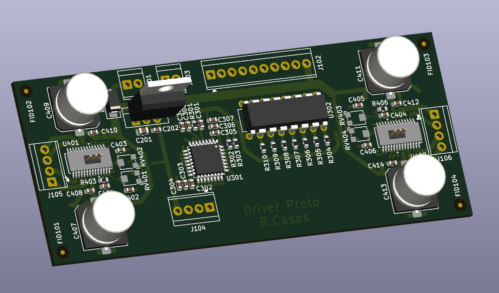
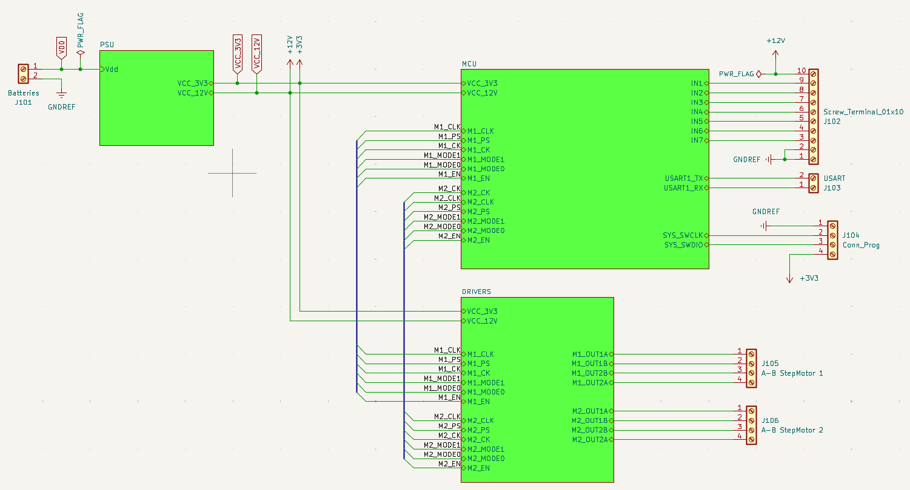
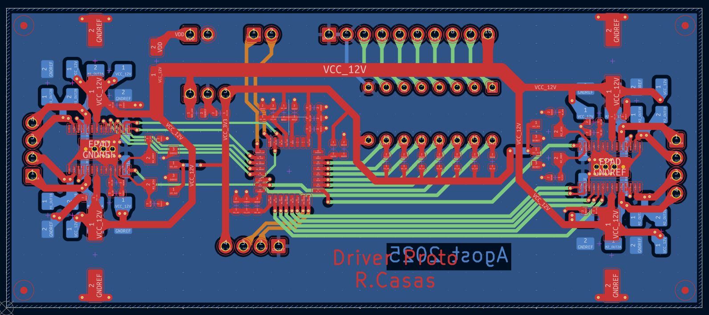

# 🌀 PCB_Driver_Stepper
**General Stepper Motor Driver Board**

---

## 📘 Overview
**PCB_Driver_Stepper** is a general-purpose stepper motor driver board designed in **KiCad 9**.  
This project was created to explore stepper motor control concepts, test design ideas from friends, and gain real experience with PCB design and STM32 microcontroller integration.  
It also represents my first complete project combining **hardware and STM32 firmware** using **STM32CubeIDE**.

  
   
  <em>3D render of the finished PCB_Driver_Stepper board</em>

---

## ⚙️ General Information
- First real **KiCad 9** project.
- Implemented to test and validate several design ideas.
- Tested multiple implementations, including **ULN2002** and different **power dissipation** techniques.
- Designed with **4 layers**, though a **2-layer** version could be achieved.
- Typical **FR4 PCB**, **1.6 mm thickness**, standard prepreg stackup.
- Serves as my first practical integration within **STM32CubeIDE**, using **STM32F030K6T6** as the MCU.

  
   
  <em>Schematic, Block diagram (KiCad 9)</em>

---

## 🔧 Characteristics
- **Fully functional**, fabricated and tested successfully.
- Tested with **STEPPERONLINE NEMA 17** (2A, 59 N·cm) — achieves over **300 RPM** without load.
- Capable of controlling **two stepper motors** simultaneously.
- Supports up to **2 A per motor**, limited by drivers and onboard potentiometers.
- **Operating voltage:** 12 VDC to 24 VDC (ideal at 24 V).
- Requires **external cooling** (top and bottom) for continuous operation (Alimunium or Copper Radiators used in real test).
- Integrated with **ULN2002A** as input mode (tested and working).
- Uses **pin connectors under driver GND pads** to allow hand-soldering.
- Optional **Schottky diodes** for additional protection and power isolation.

  
   
  <em>PCB layout design</em>

---

## ⚠️ Known Issues / Notes
- Thermal pads on the **Rsense GND pads** restrict efficient heat dissipation.
- Ideally should maintain a **4-layer design** to ensure proper driver thermal management (as recommended in datasheets).
- **No status LEDs** (e.g., Power or Fault indicators) currently included — consider adding in future revisions.

---

## 🧩 Files and Structure

  

## 🎬 Demo Video
[▶️ Watch Demo](Test_media/NEMA_Stepper.mp4)

  <video src="https://github.com/user-attachments/assets/646c0d09-2157-4537-b24f-0206d356a9b6" width="600" controls></video>
   
  <em>Demo NEMA Stepper</em>

