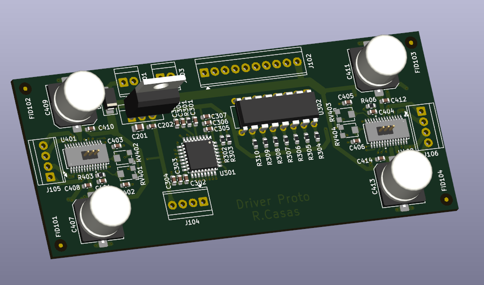
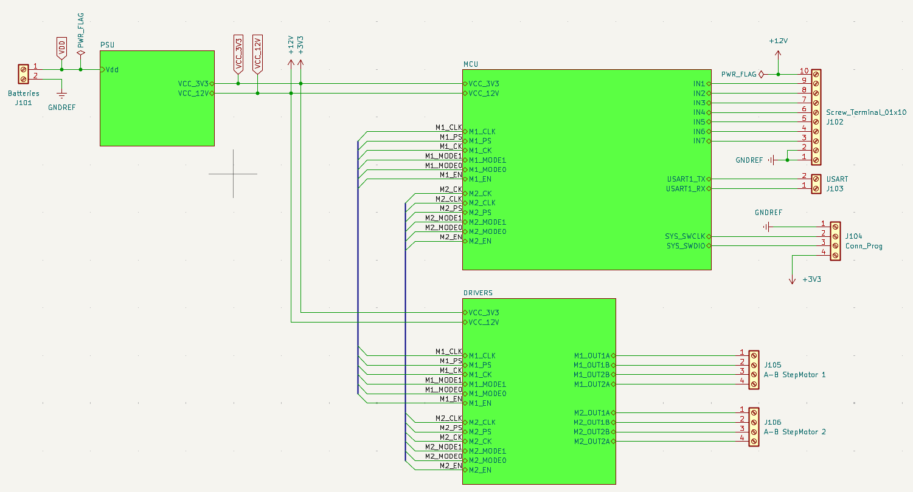
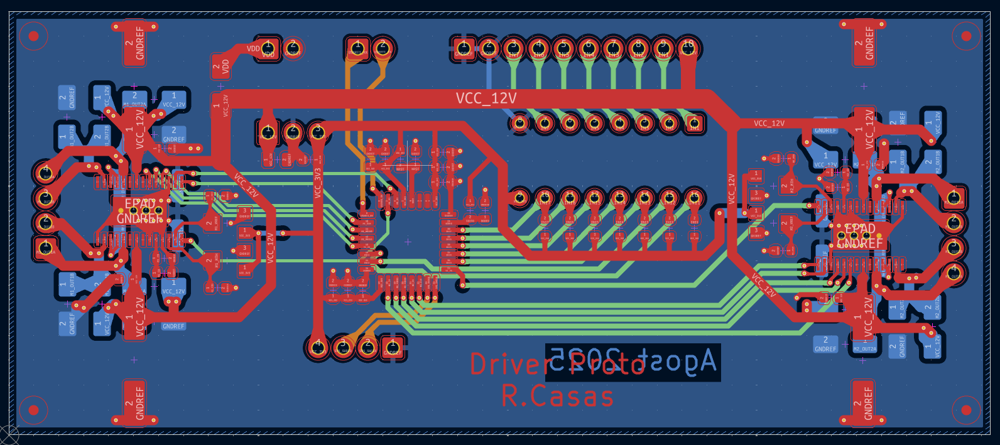

# 🌀 PCB_Driver_Stepper
**General Stepper Motor Driver Board**

## 🎬 Demo Video
[▶️ Watch Demo](Test_media/NEMA_Stepper.mp4)

  <video src="https://github.com/user-attachments/assets/646c0d09-2157-4537-b24f-0206d356a9b6" width="600" controls></video>
   
  <em>Demo NEMA Stepper</em>

---

## 📘 Overview
**PCB_Driver_Stepper** is a general-purpose stepper motor driver board designed in **KiCad 9**.  
This project was created to explore stepper motor control concepts, test design ideas from friends, and gain real experience with PCB design and STM32 microcontroller integration.  
It also represents my first complete project combining **hardware and STM32 firmware** using **STM32CubeIDE**.

  
   
  <em>3D render of the finished PCB_Driver_Stepper board</em>

---

## ⚙️ General Information
- First real **KiCad 9** project.
- Implemented to test and validate several design ideas.
- Tested multiple implementations, including **ULN2002** and different **power dissipation** techniques.
- Designed with **4 layers**, though a **2-layer** version could be achieved.
- Typical **FR4 PCB**, **1.6 mm thickness**, standard prepreg stackup.
- Serves as my first practical integration within **STM32CubeIDE**, using **STM32F030K6T6** as the MCU.

  
   
  <em>Schematic, Block diagram (KiCad 9)</em>

---

## 🔧 Characteristics
- **Fully functional**, fabricated and tested successfully.
- Tested with **STEPPERONLINE NEMA 17** (2A, 59 N·cm) — achieves over **300 RPM** without load.
- Capable of controlling **two stepper motors** simultaneously.
- Supports up to **2 A per motor**, limited by drivers and onboard potentiometers.
- **Operating voltage:** 12 VDC to 24 VDC (ideal at 24 V).
- Requires **external cooling** (top and bottom) for continuous operation (Alimunium or Copper Radiators used in real test).
- Integrated with **ULN2002A** as input mode (tested and working).
- Uses **pin connectors under driver GND pads** to allow hand-soldering.
- Optional **Schottky diodes** for additional protection and power isolation.

  
   
  <em>PCB layout design</em>

---

## ⚠️ Known Issues / Notes
- Thermal pads on the **Rsense GND pads** restrict efficient heat dissipation.
- Ideally should maintain a **4-layer design** to ensure proper driver thermal management (as recommended in datasheets).
- Too many bypass Capacitors on the MCU.
- **No status LEDs** (e.g., Power or Fault indicators) currently included — consider adding in future revisions.

---

## 🧩 Files and Structure

  

PCB_Driver_Stepper/

├── schematic/ # KiCad schematic files

├── pcb_layout/ # KiCad PCB layout files

├── gerbers/ # Gerber fabrication files

├── images/ # Rendered visuals (3D, SCH, PCB)

├── LICENSE # Hardware license (CERN-OHL-P v2.0)

└── README.md # Project documentation

---

## 📜 License
This hardware design is released under the **CERN Open Hardware License v2 – Permissive (CERN-OHL-P-2.0)**.  
You are free to use, modify, and distribute this design, provided that:
- The license is included with redistributions.
- Proper credit is given to the original author.

More info: https://cern-ohl.web.cern.ch/

---

## 👤 Author
**Project:** PCB_Driver_Stepper  
**Author:** Kolicks  
**Toolchain:** KiCad 9  
**Version:** 9.0  

---

## 🧱 Future Improvements

- **Thermal Design Enhancements:**  
  - Improve **thermal via networks** around driver ICs.  
  - Add **dedicated copper areas** and optional heatsink support for improved temperature control.  

- **User Feedback & Indicators:**  
  - Integrate **status LEDs** for power, enable, and fault signals.  
  - Add a **motor activity indicator** (blinking per step pulse).  

- **Electrical Optimization:**   
  - Consider **thicker copper (2 oz)** for better power handling.  
  - Optimize **Rsense trace routing** to reduce noise coupling.  

- **Mechanical Improvements:**  
  - Adjust mounting hole positions for compatibility with standard enclosures.  
  - Add **labeling and silkscreen clarity** for easier connection identification.  

---

⭐ *If you find this project useful or educational, please consider starring the repository and sharing feedback!*
